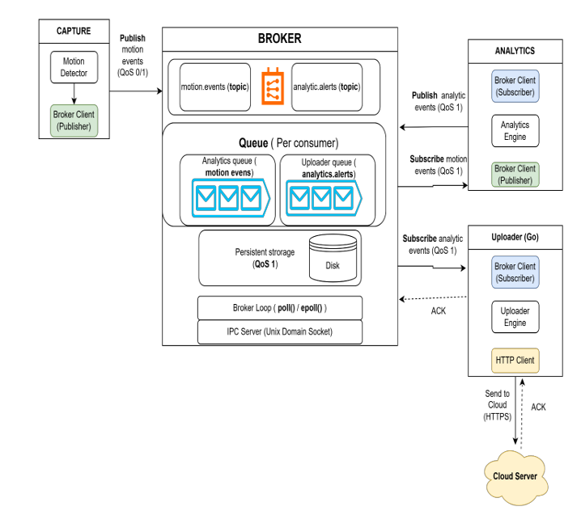

# Project Description:
A simple Local (IPC Based) broker implementation that is intended to be deployed strictly on Linux for resource constrained embedded devices.

# System Architecture:
The Broker is the only component responsible for routing messages between services. Producers never communicate directly with consumers.

## Processes:
- broker: routes messages
- capture: publishes motion events
- analytics: consumes motion, publishes alerts
- uploader: consumes alert and simulates cloud upload

## Message Format

Communication between processes is performed using JSON messages.

Generic message format:

```json
{
    "version": 1,
    "type": "publish",
    "message_id": "msg-001",
    "topic": "motion.events",
    "qos": 0,
    "client_id": "capture",
    "payload": {}
}
```
The broker uses the message metadata for routing, while the payload contains application-specific data.

## Topics

| Topic | Producer | Consumer |
|--------|----------|----------|
| motion.events | Capture | Analytics |
| analytics.alerts | Analytics | Uploader |

## Quality of Service

Two QoS levels are implemented to distinguish the importance and persistance of the event messages.

### QoS 0

- Lightweight
- Best-effort delivery
- Memory-only queue
- Messages may be dropped if queues become full
- Suitable for high-frequency motion events

### QoS 1

- At-least-once delivery
- Persisted to disk until acknowledged
- Survives process restart and power loss
- Suitable for important alert messages


## System Architecture:
Relevant design documents can be found in the  `docs/` directory



## High Level Sequence Diagram:
``` Capture -> Broker -> Analytics -> Broker -> Uploader -> Cloud```


# Build and Run
### Requirements:
- Linux ( I use WSL Ubuntu image)
- CMake 3.16+
- C++ compiler with C++20 support (GCC or Clang)

### Build:
From the project root:

```cmake -S . -B build```

```cmake --build build -j```

This produces binaries in:
- build/bin/broker
- build/bin/capture
- build/bin/analytics

### Run:
To build and run all services with one script:

```chmod +x init.sh```

```./init.sh```